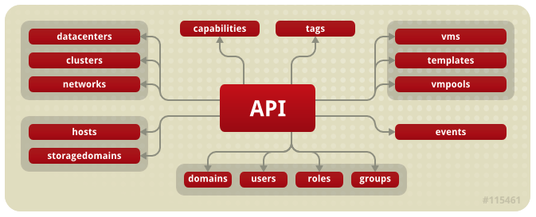

# 链接元素

访问切入点为API显现出来的所有的资源集合提供了链接元素和统一资源标示符。每一个集合都会使用一种关联类型来鉴定客户端需要的资源标示符

|关系|描述|
|----|----|
|*capabilities*|OVIRT企业级虚拟管理具有的性能|
|*datacenters*|数据中心|
|*clusters*|主机集群|
|*networks*|虚拟网络|
|*storagedomains*|存储域|
|*hosts*|主机|
|*vms*|虚拟机|
|*disks*|虚拟机硬盘|
|*templates*|模板|
|*vmpools*|虚拟机池|
|*domains*|标识服务域|
|*groups*|被导入的标识服务群|
|*roles*|角色|
|*users*|用户|
|*tags*|标签|
|*events*|事件|

> **Note**
>
> 显示在示例相应中的所有资源标识符独具有说明性。服务器传回来的所有统一资源标识符的格式都很模糊。
> 服务器选择在*链接*元素的*href*属性中包含绝对资源标识符或者绝对路径，所以客户端需要去处理这两种形式。

*链接*元素还为某些集合包含了一系列的*搜索*URI。这些URI使用了URI模板来集成搜索查询。URI模板的作用是接受一个使用了查询参数的HTTP模式的检索表达式。客户端对较早的URI结构的只是没有过高的要求。然而，客户端不可以忽视URI模板并且要通过URI模板库来获得它们。每一个检索查询URI模板都是以一个关系类型为命名标准，通常的命名格式为:*"collection/search"*

|关系|描述|
|----|----|
|*datacenters/search*|查询数据中心|
|*clusters/search*|查询主机集群|
|*storagedomains/search*|查询存储域|
|*hosts/search*|查询主机|
|*vms/search*|查询虚拟机|
|*disks/search*|查询硬盘|
|*templates/search*|查询模板|
|*vmpools/search*|查询虚拟机池|
|*events/search*|查询事件|
|*users/search*|查询用户|

