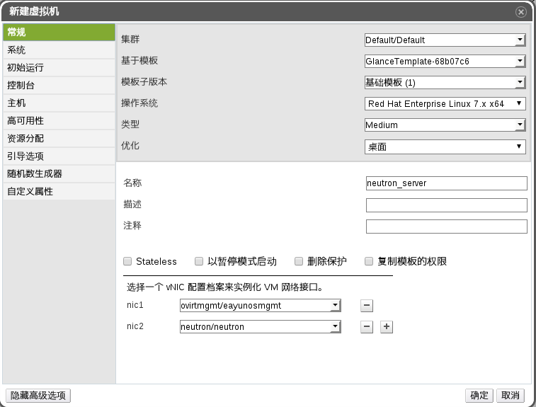
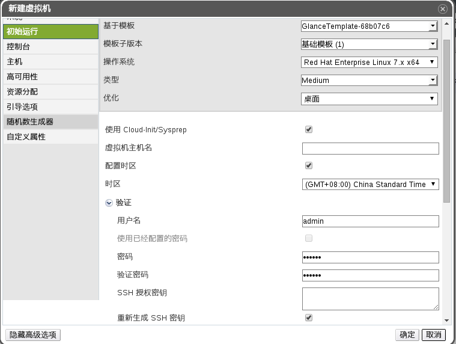
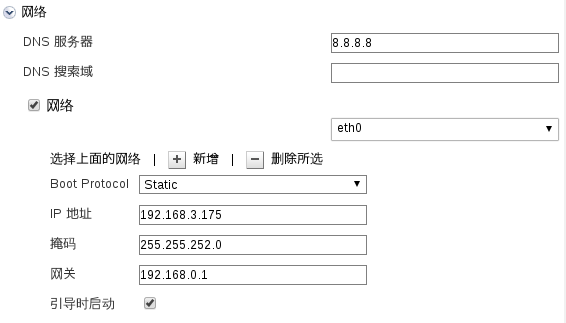

# 设置 neutron 服务虚拟机

本流程将介绍如何将包含 neutron 服务的模板导入到 EayunOS 的环境中。

1. 导入包含 neutron 服务的模板

   * 进入 EayunOS 管理平台，切换到**存储**选项卡
   * 找到并选中名称为 **neutron_appliance**，类型为 **Export** 的存储域。
   * 在下方子标签中选择**数据中心**标签，并点击**附加**，并在弹出窗口中选择一个[已经设置好 neutron 逻辑网络](preparation.md)的数据中心。
   * 等待该导出域变成 **UP** 后，在子标签中选择**模板导入**，并在下方列表中选择 **GlanceTemplate-XXXXXXX** 模板，然后点击**导入**。并在弹出窗口中设置好具体的集群等信息，然后点击**确定**。

2. 设置包含 neutron 服务的虚拟机

   * 等待模板导入完成后，基于该模板创建一台虚拟机，具体设置如下：

     **常规**选项卡：

     

     > **注意**
     >
     > **优化**的选择为**桌面**时，虚拟机的创建速度可以大大增加，但是创建后依赖模板；
     > **优化**的选择为**服务器**时，虚拟机的创建速度较慢，但是创建完成后不依赖模板。

     **初始运行**选项卡的验证部分：

     

     > **注意**
     >
     > **用户名**设置的是 ssh 登陆 neutron 服务虚拟机的用户名。

     **初始运行**选项卡的网络部分：

     eth0：

     

     eth1：

     

     > **注意**
     >
     > 这里需要设置两张网卡：**eth0** 和 **eth1**。
     >
     > 其中 **eth0** 网卡用作管理网络，需要设置一个固定的 IP 地址，方便以后访问，这里设置的 IP 地址仅供参考，在下面的过程中都以图中设置的 IP 地址代表 neutron 服务器的 IP 地址。
     >
     > **eth1** 网卡用作 neutron 的通信信道，不需要设置 IP 地址。

   * 点击**确定**保存虚拟机设置。
   * 启动虚拟机。
   * 等待 3~5 分钟后，通过 ssh 终端访问 neutron 服务器（ssh 使用的用户名和密码为上述**初始运行**设置中的用户名和密码），设置内置于 neutron 服务器中的 keystone 服务的密码：

     ```
     [someone@sshclient ~]$ ssh admin@192.168.3.175
     admin@192.168.3.175's password: 
     Last login: Fri Sep 11 19:34:09 2015 from 192.168.255.200
     [admin@localhost ~]$ sudo -i
     [root@localhost ~]# . ~/keystonerc_admin 
     [root@localhost ~(keystone_admin)]# keystone user-password-update neutron
     New Password: 
     Repeat New Password: 
     [root@localhost ~(keystone_admin)]# openstack-service restart neutron-server
     [root@localhost ~(keystone_admin)]# 

     ```

   * 更新 neutron 配置文件中的 keystone 密码：

     通过 ssh 连接至 neutron 服务器，并更新 **/etc/neutron/neutron.conf** 配置文件中的 **admin_password** 属性值为上一步所设置的密码。
