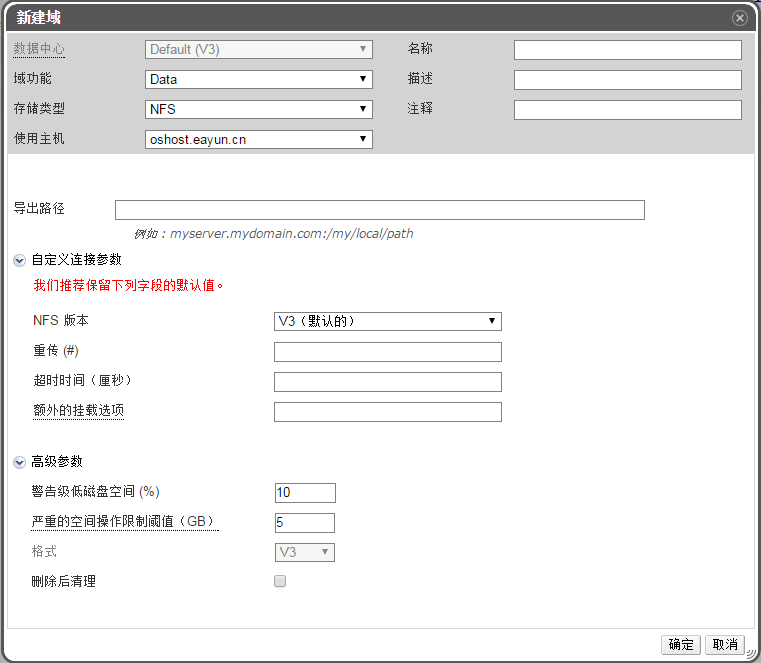

# 添加 NFS 存储

**概述**

NFS 存储域可以用来存放虚拟机镜像文件、ISO 文件或者用来作为导出域。

1.在 EayunOS 管理界面中打开**存储**标签列出已存在的存储域。

2.点击**新建域**按钮打开**新建域**窗口。

**添加 NFS 存储**

3.输入存储域的**名称**（比如 test-nfs）。

4.从下拉菜单中选择**数据中心**、**域功能/存储类型**和**使用主机**。

5.如果可用，使用下拉菜单选择适当的**格式**。

6.最后，在**导出路径**中填写 NFS 服务器的完整路径，比如
192.168.2.69:/home/data，然后点击确定，一段时间之后，你会看见我们新建的存储域已经在存储列表里面了

> **重要**
>
> 与存储域的通信都通过所选择的**使用主机**而不是通过 EayunOS
> 管理中心本身。所以至少数据中心中必须有一台活动主机才能够配置存储。

**结果**

新建的 NFS 存储域将会出现在**存储**标签下，其状态显示为
**Locked**。操作完成之后它将会被自动附加至数据中心。

