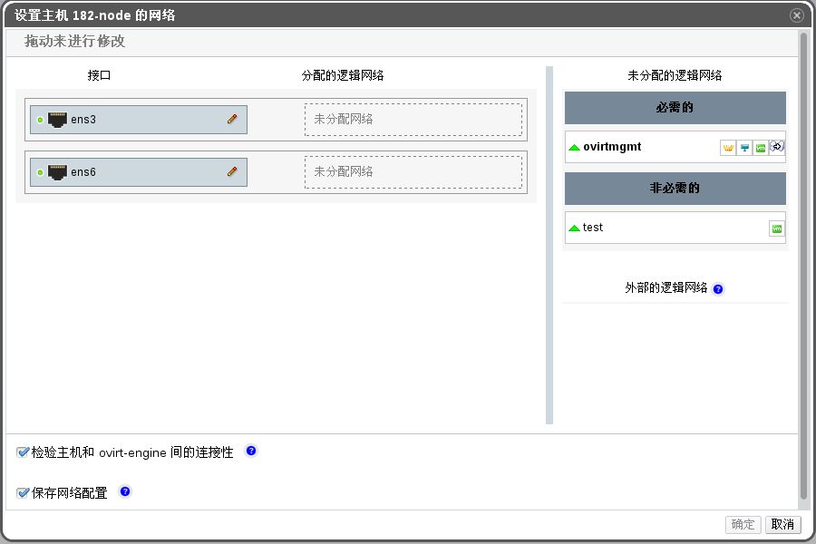

# 编辑主机网卡和添加逻辑网络到主机

**概述** 
  您可以修改主机上网卡的设置，将管理网络从一台物理主机移动到另一台物理主机上，并将逻辑网络分配到主机的网络接口上。

**编辑主机网卡并给主机分配逻辑网络**

1. 使用**主机**标签、树形面板或者搜索功能查找并在主面板中选择主机。
1. 点击详情面板中的**网络接口**子标签以列出该主机上的网卡及它们的配置信息。
1. 点击**设立主机网络**按钮打开**设立主机网络**窗口。

 

 **设立主机网络窗口**

1. 通过选择并拖拽逻辑网络到网卡旁边的**分配的逻辑网络**区域，来将逻辑网络连接到网卡。

  另外，还可以通过右键点击逻辑网络，并在下拉菜单中选择网卡。

1. 配置逻辑网络。
  1. 将您的鼠标光标置于已分配的逻辑网络之上，点击铅笔小图标打开**编辑网络**窗口。
  1. 如果您的逻辑网络的配置与主机上的设置并未同步，请勾选**同步网络**选项。

    * 从以下内容中选择**引导协议**：
      * **None**，
      * **DHCP**，或者
      * **Static**。

    如果您选择了**Static**，请提供 **IP**、**子网掩码**和**网关**。

  1. 点击**确定**。

1. 勾选**检查主机和eayun-engine间的连接性**来检查网络；该选项仅在主机处于维护模式时可用。
1. 如果您希望所做的网络修改永久保存不受环境重启影响，请勾选**保存网络配置**。
1. 点击**确定**保存所做的修改并关闭该窗口。

**结果** 
  您成功的将逻辑网络分配到主机上的网卡并配置了主机的网络

> **注意**

> 如果未正常显示所有在主机上的网卡，请点击**刷新能力**按钮以更新主机上可用的网卡列表。
