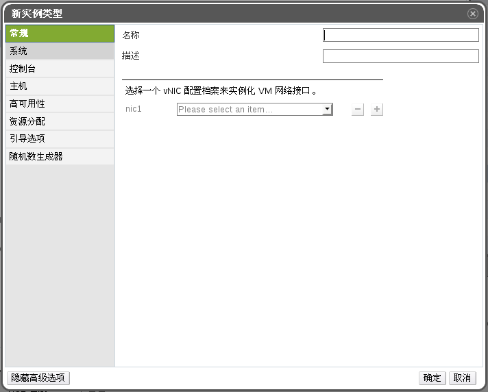

# 类型

类型定义一个虚拟机的硬件配置，当创建或者编辑虚拟机时选择一个类型，虚拟机硬件配置的字段将会自动填写该类型定义的值。用户可以用它来创建多个硬件配置想同的虚拟机，而不需要手动填写每个字段。

默认情况下有一组预定义的类型可供选择，如下表所示：

|名称|内存|虚拟CPU总数|
|----|----|-----------|
|Large|8GB|2|
|Medium|4GB|2|
|Small|2GB|1|
|Tiny|512MB|1|
|XLarge|16GB|4|

管理员可以在**配置**窗口的**类型**标签下创建、编辑、删除类型。

**配置窗口**

当新建或者编辑虚拟机时，如果窗口中的**类型**字段绑定一个特定类型，则一些属性字段左边会出现一个连接图标，如果有属性字段被更改，则左边的连接图标会显示成断开，该类型将自动与虚拟机分离。如果将更改的字段值再改回去，则恢复原先所选的**类型**连接。

##新建类型

**摘要**

管理源可以新建一个类型来供用户新建或编辑虚拟机时使用。

1.点击头部栏的**配置**按钮，打开配置窗口。

2.点击**类型**标签。

3.点击**新建**按钮，打开**新建实例类型**菜单。

**新建实例类型**

4.在**常规**标签中填入**名称**和**描述**，其他字段可以使用默认值，也可以根据需要自主修改。

5.依次点击**系统**、**控制台**、**主机**、**高可用性**、**资源分配**、**引导选项**、**随机数生成器**等标签来定义所需类型属性。这些设置会在**新建虚拟机**窗口的相关字段上显示。

6.点击**确定**，新建类型，并关闭窗口。

**结果**

新建的**类型**将显示在**配置**窗口的**类型**标签下，当创建或者编辑虚拟机时，可以在**类型**下拉菜单中选择该类型。
