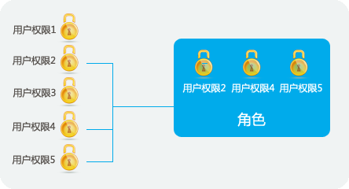

# 系统权限

权限允许用户对对象执行操作，对象可以是单独的对象，也可以是容器对象（如数据中心、集群等）。

 
**权限角色**

任何应用于容器对象的权限同样也会应用到该容器的所有成员中。下面的图表描述了系统中对象的层级结构。

 
**EayunOS 企业级虚拟化中对象的层级构架**

**用户属性**

角色和权限都是用户的属性。角色是一组预定义的权限的集合，有了它您就可以对不同级别的物理资源和虚拟资源进行访问。多层管理为提供了权限的细粒度层次结构。例如，一个数据中心管理员具有管理该数据中心中所有对象的权限，而一个主机管理员则具有对单独一个物理主机的系统管理员权限。一个用户可以拥有使用单独一台虚拟机但不能对该虚拟机的配置做任何修改的权限，而另一个用户则可以分配到对一台虚拟机的系统管理的权限。

