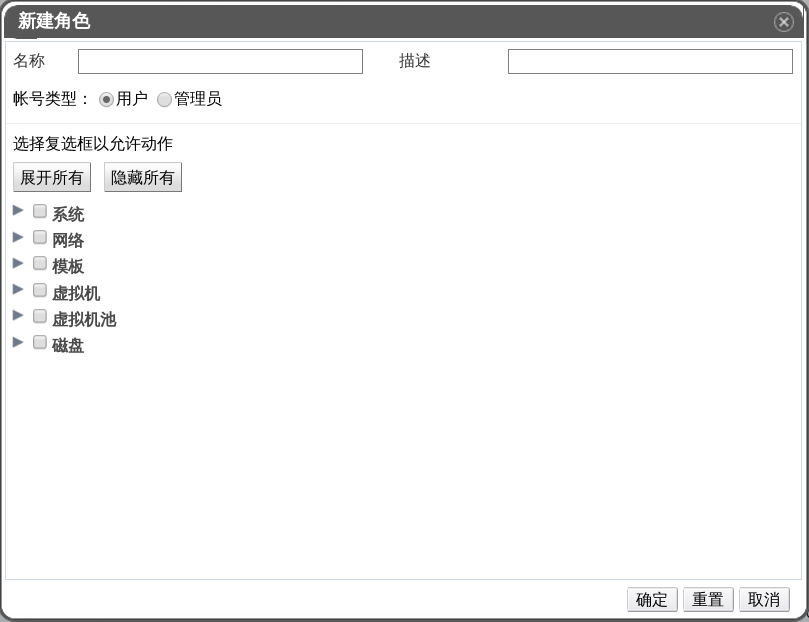

# 角色

角色是 EayunOS 企业级虚拟化环境中一组预定义好了的权限集合，且您可以对该集合进行配置。在数据中心中角色提供了对不同级别资源的访问权限和管理权限，尤其是对物理资源和虚拟资源来说。

多级权限管理指的是，任何应用于一个容器对象的权限也就应用到了这个容器内所有的个体对象。例如，如果一个主机管理员角色分配给了一个特定主机上的用户，那么该用户就获得了可对该主机进行的任何操作的权限，前提是只限定于这台主机。然而，如果主机管理员角色分配给了一个数据中心用户，那么该用户就获得了对这个数据中心下所有集群里主机进行操作的权限。

#新建角色
**摘要** 
若果你所需的角色不在 EayunOS 企业级虚拟化的默认角色列表中，您可以新建一个新的角色，并对其进行定制来满足您的需求。

**新建一个新的角色**

<<<<<<< HEAD
1. 在头部栏中，点击**配置**按钮，会弹出**配置**窗口。该窗口显示一组默认的用户角色和管理员角色，以及任何自定义角色。
=======
1. 在头部栏中点击**配置**按钮，打开配置窗口。该窗口显示一组默认的用户和管理员角色，以及任何自定义角色。
>>>>>>> a9b6c348db17477150fd56ab0f7c1e9fa4697b2c

2. 点击**新建**，显示新建对话框。

  
 **新建角色窗口**

<<<<<<< HEAD
3. 输入新角色的**名称**和**描述**。

4. 选择**帐户类型**（**管理员**或**用户**）。

5. 点击**展开所有**或**隐藏所有**按钮来查看**允许操作的复选框**列表中列出的更多的对象权限。
=======
3. 输入**名称**和**描述**

4. 选择帐户类型（管理员或用户）。

5. 点击**展开所有**和**隐藏所有**按钮来查看更多复选框中列出的实体权限。也可以展开或隐藏每个实体的选项属性。
>>>>>>> a9b6c348db17477150fd56ab0f7c1e9fa4697b2c

6. 对于每个实体，选择或者清除复选框来完成对该角色的配置。

7. 点击**确定**提交更改，新的角色将显示在角色列表中。

**结果** 
您已经成功创建了拥有特定资源权限的角色。你可以将该角色分配给用户了。
