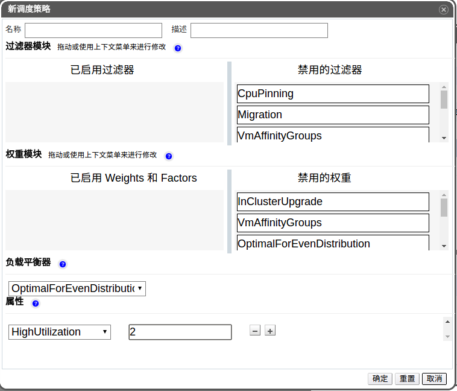

# 集群策略

集群策略是一组规则的集合，它定义了集群中主机上分布的虚拟机使用资源的逻辑。该逻辑通过组合过滤器，weightings以及负载均衡策略来实现。Eayun虚拟化管理系统提供了4个默认的集群策略：evenly_distributed、none、power_saving和vm_evenly_distributed。也可以自定义新的集群策略来为分布的虚拟机提供更精细的控制。

## 新建集群策略

*摘要*

你可以为Eayun虚拟化管理系统中的集群创建新的集群策略来定义分布在该集群中虚拟机的控制逻辑。

1.点击管理门户中头部栏上的*配置*按钮，打开*配置*窗口。

2.点击*集群策略*，查看该标签。

3.点击*新建*，打开*新建集群策略*窗口。

4.填写集群策略的名称和描述。

5.配置过滤器模块：

  a. 在过滤器模块这部分，拖动*已禁用过滤器*中内容到*已器用过滤器*中来实现功能。

  b. 某个特定的过滤器模块可以被设置为第一个，拥有最高优先权，或者设置为最后一个，拥有最低优先权。这是最基本的优化。

6.配置weights模块

 a. 在过滤器模块这部分，拖动*已禁用过滤器*中内容到*已器用过滤器*中来实现功能。

 b. 使用左边的*+*和*-*按钮来增加或减少这个模块的权重。

7.负载平衡器

 a. 在下拉菜单中为集群选择一个负载均衡策略。

 b. 在属性部分的下拉菜单中为集群选择一个负载均衡策略，在右边的文本框中为该属性指定值。

 c. 使用*+*和*-*按钮来添加或去除属性。

8.点击*确定*。

*结果*

新的集群策略已经被创建，可以在Eayun虚拟化管理系统中使用了。
