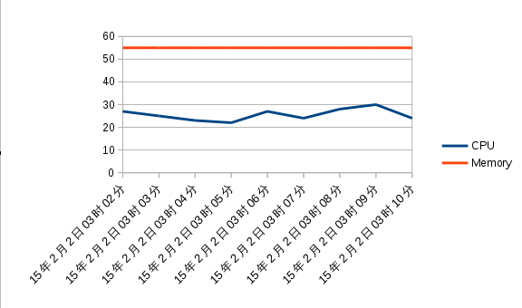
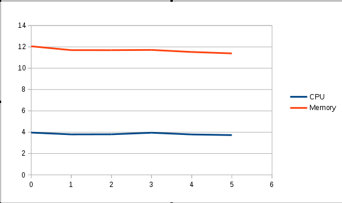

# 历史数据库报表

下面的示例介绍了如何通过查询 **ovirt_engine_history** 数据库来产生报表。该数据库允许用户访问大量的数据集并使生成大量复杂的报表成为可能。这些示例仅展示了基本的报表需求。

**一台主机上的资源使用率**

这个示例会生成一个关于一台单独主机的资源使用率情况的报表。该资源使用率报表提供了每隔一分钟所获得的 CPU 使用率百分比和内存使用百分比的信息。这种报表可以让用户更好的了解一个单独的主机在短时间内的负载情况。下面的 SQL 查询语句定义了这个报表。要确保 **where** 子句中的 **host_name** 和 **history_datetime** 都已替换为当前环境中的实际值。

> **一台主机资源使用率的报表查询**
>
> ```
> select history_datetime as DateTime, cpu_usage_percent as CPU, memory_usage_percent as Memory
    from host_configuration, host_samples_history
    where host_configuration.host_id = host_samples_history.host_id
    and host_name = 'example.labname.abc.company.com'
    and host_configuration.history_id in (select max(a.history_id)
    from host_configuration as a
    where host_configuration.host_id = a.host_id)
    and history_datetime >= '2011-07-01 18:45'
    and history_datetime <= '2011-07-31 21:45'
> ```

这个查询所产生的结果表的每一行代表了每一分钟的数据：

**一台主机资源利用率的数据实例**

| **DateTime** | **CPU** | **Memory** |
| ------------ | ------- | ---------- |
| 2015-02-02 03:02:14 | 27 | 55 |
| 2015-02-02 03:03:14 | 25 | 55 |
| 2015-02-02 03:04:14 | 23 | 55 |
| 2015-02-02 03:05:14 | 22 | 55 |
| 2015-02-02 03:06:14 | 27 | 55 |
| 2015-02-02 03:07:14 | 24 | 55 |
| 2015-02-02 03:08:14 | 28 | 55 |
| 2015-02-02 03:09:14 | 30 | 55 |
| 2015-02-02 03:10:14 | 24 | 55 |

通过使用第三方的数据分析软件和虚拟化工具（如 **OpenOffice.org Calc** 和 **Microsoft Excel**）可以把这些数据以图表的形式显示出来。例如，显示了一段时间内一台单独的主机使用率的折线图是一个非常有用的可视化资源。下图是通过使用 **OpenOffice.org.Calc** 中的 **Chart Wizard** 工具来生成的。



**单独一台主机使用率的折线图**

**所有主机的资源使用率**

这个示例生成了一个整合 EayunOS 企业级虚拟化管理中心环境中所有主机资源使用率的报表。这个报表包括了每隔 1 小时所获得的资源使用率的数据（CPU 使用的百分比的平均值和内存使用的百分比平均值）。这类报表可以让用户在较长的时间范围内了解整个环境中主机的使用率趋势。对性能的规划是非常有用的。下面的 SQL 查询语句定义了该报表。要确保 **where** 子句中的 **history_datetime** 已替换为当前环境中的实际值。

> **所有主机资源利用率的报表查询**
>
> ```
> select extract(hour from history_datetime) as Hour, avg(cpu_usage_percent) as CPU, avg(memory_usage_percent) as Memory
    from host_hourly_history
    where history_datetime >= '2011-07-01' and history_datetime < '2011-07-31'
    group by extract(hour from history_datetime)
    order by extract(hour from history_datetime)
> ```

这个查询所产生的结果表的每一行代表了每一小时的数据：

**所有主机资源利用率的数据实例**

| **Hour** | **CPU** | **Memory**|
| -------- | ------- | ----------|
| 0 | 3.9649122807017544 | 12.0555555555555556|
| 1 | 3.7946428571428571 | 11.6964285714285714|
| 2 | 3.8035714285714286 | 11.6934523809523810|
| 3 | 3.9522388059701493 | 11.7134328358208955|
| 4 | 3.7876106194690265 | 11.5221238938053097|
| 5 | 3.7291666666666667 | 11.3898809523809524|

通过第三方的数据分析和虚拟化工具（如 **OpenOffice.org** 和 **Microsoft Excel**），可以把这些数据以图表的形式显示出来。拿这个例子来说，在一段时间内显示的所有系统使用率的折线图是非常有用的可视化资源。下图是通过使用 **OpenOffice.org Calc** 中的 **Chart Wizard** 工具来生成的。



**所有系统利用率的折线图**

**最新虚拟机配置的标签过滤**
这个实例使用历史标签表过滤最新的虚拟机配置列表。这种报表展示了 EayunOS 企业级虚拟化管理中心用于过滤配置列表的标签树的使用。下面的 SQL 查询语句定义了该报表。该查询语句使用了一个预定义函数来获取标签历史 ID 并返回带有管理员门户中最新名字的标签的路径。要确保 **where** 部分中值已替换为您当前环境中的实际值。

> ****
> ```
> SELECT vm_name
    FROM vm_configuration
    inner join latest_tag_relations_history on (vm_configuration.vm_id = latest_tag_relations_history.entity_id)
    inner join latest_tag_details on (latest_tag_details.tag_id = latest_tag_relations_history.parent_id)
    WHERE getpathinnames(latest_tag_details.history_id) like '/root/net%'
> ```

这个查询命令返回的结果表包含了所有附加到这个标签上的虚拟机的名称。

**最新虚拟机配置的标签过滤**

| **vm_name** |
| ----------- |
| neutron_yaqitest |
| Coffee_Pool-2 |
| lvqin_test_CentOS_6.5 |

**列出当前虚拟机的名称，类型和操作系统**

这个实例生成了一个 EayunOS 企业级虚拟化管理中心环境中虚拟机的名称，类型和操作系统的列表。这种报表显示了对枚举的使用。以下是定义这个报表的 SQL 查询语句：

> ****
>
> ```
> SELECT vm_name, vm_type, operating_system
    FROM vm_configuration
  inner join enum_translator as vm_type_value on (vm_type_value.enum_type = 'VM_TYPE' and vm_configuration.vm_type = vm_type_value.enum_key)
  inner join enum_translator as os_value on (os_value.enum_type = 'OS_TYPE' and vm_configuration.operating_system = os_value.enum_key);
> ```

这个查询命令返回的结果表包括了虚拟机的名称、操作系统和虚拟机类型：

**当前虚拟机的名称，类型和操作系统**

| **vm_name** | **vm_type** | **operating_system** |
| ----------- | ----------- | -------------------- |
| debian7               |       1 |            1300|
| ply                   |       1 |              11|
| lvqin_test            |       1 |               0|
| Coffee_vm_2           |       1 |               0|
| Coffee_vm_test        |       1 |               0|
| rhel                  |       1 |              24|
| lvqin_test_0-1        |       1 |              11|
| Coffee_vm_1           |       1 |              24|
| test_neutron_int_zc   |       0 |               0|
| win7                  |       0 |              12|
| lvqin_test_CentOS_6.5 |       1 |               0|
| win                   |       1 |              12|
| lvqin_test            |       1 |               5|
| test-pool             |       1 |               0|
| ply                   |       1 |               0|
| Coffee_test_1         |       1 |               0|
| lvqin_test_0-2        |       1 |               0|
| z-debian7             |       1 |            1300|
| Coffee_vm_1           |       1 |               0|
| plyT                  |       0 |               0|
| Coffee_Pool-2         |       0 |               0|
| neutron_yaqitest      |       1 |               0|
| a                     |       1 |               0|
| test                  |       1 |               0|
| HostedEngine          |       0 |               0|
| lvqin_test_0-1        |       1 |               0|
| external-vm_win8      |       0 |               0|
| rhel7                 |       1 |              24|
| xyy-test              |       1 |               0|
| lvqin_test_0-3        |       1 |               0|
| mazhe_test            |       0 |               0|
| test_vm_1             |       1 |               0|
| Coffee_Pool-1         |       0 |               0|
| neutron_yaqitest      |       0 |               0|
| lvqin_test_CentOS7    |       1 |               0|
| Coffee_Pool-3         |       0 |               0|
| lvqin_test_win7       |       0 |               0|
| Test_Pool             |       1 |               0|
