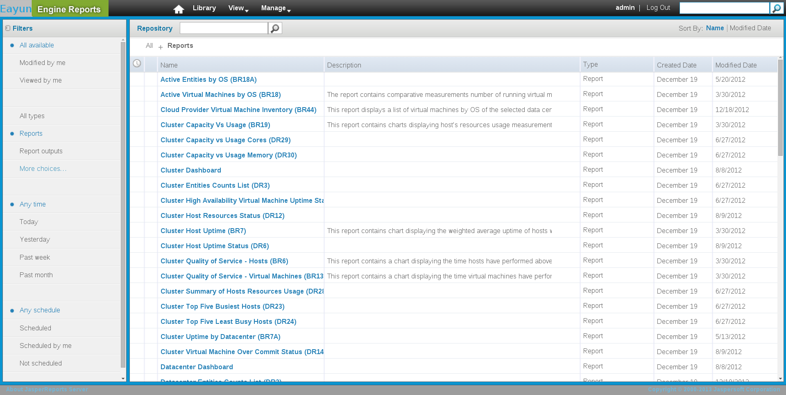
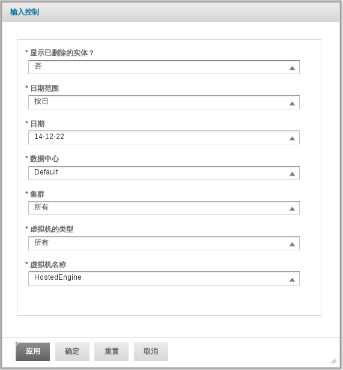

i# 报表参数

报表参数是在运行报表时由用户定义的。报表参数定义了报表的作用域和时间段。当你运行一个报表的时候，你将会看到一些符合你所选择的报表的相关参数的提示。

在报表列表中点击报表,回看到报表所需要的参数。

**图22.7. EayunOS 企业级虚拟化报表 - 报表列表**

从报表列表中选择一个报表会弹出一个**输入控制**的对话框窗口。**输入控制**窗口包含了一些下拉菜单，它可以定义报表的参数。

> **Note**
> 这个对话框是基于上下文的，不同的报表有不同的对话框。参数是由（*）标注的。

**图22.8. 报表参数选择**

## 级联参数

许多报表参数都需要级联输入。这意味着一个参数的选择会改变另一个参数的选项。**数据中心**和**集群**参数是级联的。一旦用户选择了某一数据中心，那么集群中只会出现属于这个数据中心的集群选项。同样的，如果用户选择了某一集群，那么**主机的类型**的选项栏中的选项会是在这个集群中主机的主机类型。级联参数过滤掉了没有包含在相关报表子实体内的实体。例如，一个与虚拟机有关的报表会排除不包含虚拟机的集群选项。一个与虚拟机和主机都有关的报表只会提供既包含虚拟机又包含主机的集群选项。

## 已删除的实体
一个已经从系统中删除（排除）掉的实体仍然会在报表历史数据库中发现它的记录。选择已删除的实体，譬如说集群，数据中心和主机
