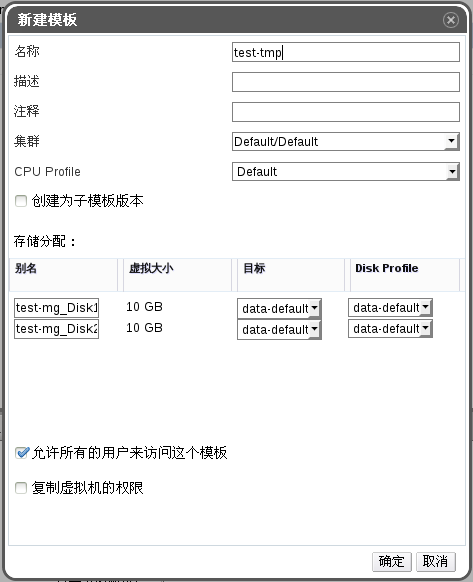

# 基于存在的虚拟机创建模板

**概述** 
基于存在的虚拟机创建模板，后续用该模板创建虚拟机。

1. 点击**虚拟机**标签列出系统中的所有虚拟机，找到需要的虚拟机。

2. 确保该虚拟机的状态是 **Down**。

3. 点击**创建模板**, 打开**新建模板**窗口。

  

  **新建模板窗**

4. 输入模板的**名称**和**描述**等。

5. 在下拉菜单中选择**集群**和存储**目标**，这两项设置的默认值与源虚拟机一样。

6. 另外，您可以选择创建为子模板版本选项。选择一个根模板并输入一个子版本名称来把新创建的模板作为一个已存在模板的子模板。

7. 在存储分配区中的别名项中为磁盘输入一个别名，并在目标下拉菜单中选择这个磁盘所在的存储域。在默认情况下，这些设置与原始的虚拟机相同。

8. 默认情况下，**允许所有的用户来访问这个模板**是被勾选的，该选项使得模板成为公共的。

9. 在默认的情况下，复制虚拟机的权限选项不会被选择。如果选择了它，原始虚拟机的权限设置会被复制到新的模板中。

10. 点击**确定**创建模板。将开始模板的创建。虚拟机的状态将变为 *Image
Locked*。这个操作将持续一段时间，具体的时间取决于你的虚拟机磁盘大小和存储硬件环境。

**结果** 
模板将被创建，在模板标签下会被显示出来。接下来用户可以基于这个模板创建虚拟机。

> **注意**
>
>在创建模板时，整个原始虚拟机会被复制。因此在创建完成后，原始虚拟机和它的模板都可以被使用。

*参见：*

-   ?

-   ?
