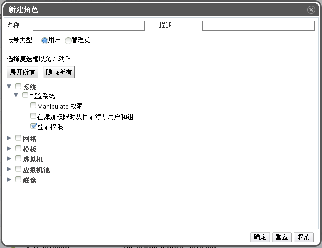

# 用户角色及授权的例子

以下例子说明了在不同的场景下，如何使用本章中描述的授权系统的不同特性进行授权控制。
> **集群权限**
>
>张三是公司财务部门的系统管理员。所有他们部门的虚拟资源都在 EayunOS
中一个叫做**财务部**的**集群**之下。在该集群上他被分配了 **ClusterAdmin**
角色。这将允许他管理集群中的所有虚拟机，因为虚拟机是集群容器中的子对象。管理虚拟机包括编辑、添加以及删除虚拟资源以及进行快照。但他将不能管理在这个集群以外的其它任何资源。由于
**ClusterAdmin**
是一个管理员角色，他能够使用管理员门户对这些资源进行管理，但他却不能够使用用户门户。

 

> **VM PowerUser权限**
>
>李四是财务部门的软件开发人员。他使用虚拟机来编译并测试他的程序。张三为他创建了一个名为**李四的桌面**的虚拟桌面。李四在**李四的桌面**这台虚拟机上被分配了
**UserVmManager**
权限。这将允许李四通过用户门户使用这台虚拟机。由于李四对这台虚拟机具有
**UserVmManager**
权限，他可以对这台虚拟机进行修改并且为其添加新资源，例如添加一个新虚拟磁盘。由于
**UserVmManager** 是一个用户角色，李四将不能够使用管理员门户。

 

> **数据中心 PowerUserRole 权限**
>
>王五是办公室经理。在他日常的职责范围之外，他还偶尔帮助人力资源经理进行一些招聘工作，例如安排面试及跟进推荐核对。根据公司政策，他需要使用特定的程序进行招聘相关的工作。

>王五日常使用他的虚拟机进行他的日常工作，他还希望创建例外一台虚拟机来运行招聘工作相关的程序。他在他将新建的虚拟机所在的数据中心上被分配了
**PowerUserRole**
权限。这是由于要创建一台新虚拟机，他将会对数据中心中的几个部分都进行修改，包括在存储域中创建新的虚拟机磁盘镜像。

>需要注意的是，这和分配给王五 **DataCenterAdmin**
权限是不一样的。作为数据中心的
**PowerUser**，王五能够登录用户门户并对该数据中心中的虚拟机进行虚拟机相关的操作。他不能够进行数据中心层面上的操作，例如添加主机或者存储到数据中心等操作。

 

> **网络管理员权限**
>
克里斯是 IT
部门的网络管理员。他日常的工作职责包括了创建、管理以及删除该部门的 EayunOS
环境中的网络。在他的岗位上要求具备对资源及资源上的网络的管理权限。例如，如果他在
IT 部门的数据中心中拥有 **NetworkAdmin**
权限，他能够在该数据中心中新建和删除网络，以及进行对该数据中心中的所有虚拟机分配及分离网络的操作。
>
在管理公司的虚拟化基础架构的网络之外，他还有一个初级的网络管理员下属叫做阿明。阿明对公司的内部培训部门的更小规模的虚拟化环境进行管理。克里斯分配给阿明对于内部培训部门使用的所有虚拟机的
**NetworkUser** 和 **UserVmManager**
权限。拥有这些权限之后，阿明可以在用户门户执行简单的管理任务，例如添加网络接口到虚拟机等。但是阿明没有权限修改虚拟机所在的主机或者数据中心的网络。

 

> **定制角色权限**
>
罗斯在 IT 部门工作，他的工作职责是管理EayunOS
中的用户账户。他需要添加用户账户以及分配给用户相应的角色和权限的权限。他自己本身不使用任何虚拟机，也不应该具有对主机、虚拟机、集群以及数据中心进行管理的权限。EayunOS
中没有默认存在的角色提供给他这样一个特定的权限组合，因此必须创建一个新的自定义角色来定义相应于他的工作职位的权限集合。

**新建角色窗口**

上面所示的 **UserManager**
自定义角色能够进行用户、权限以及角色管理。这些操作包括在 所显示的最高级别的**系统**下。这意味着这些操作将被应用于系统中的所有其它对象。该角色的**账户类型**被设置为**管理员**。这意味着当罗斯被分配这个角色时，他只能够使用管理员门户，而不是用户门户。

