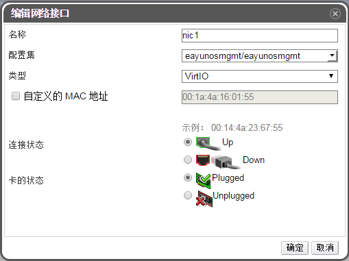
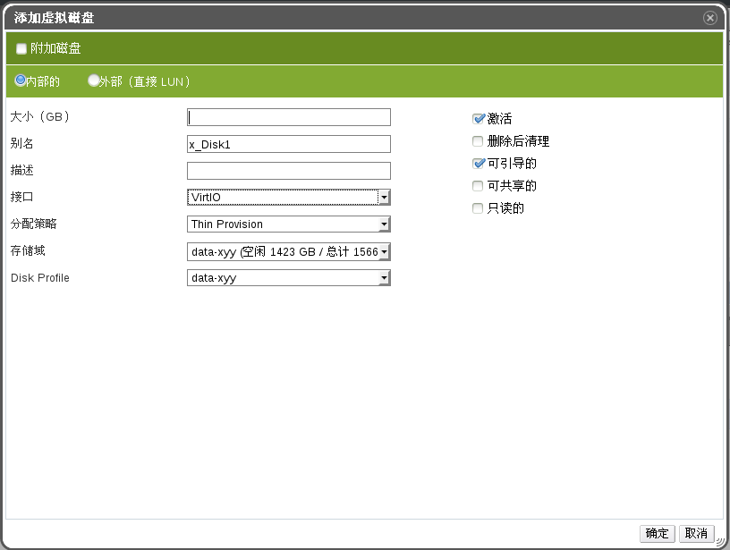

 # 定义虚拟网卡及建立磁盘，完成虚拟机设置

**摘要** 
在虚拟机可以使用之前，虚拟机至少需要一个虚拟磁盘和虚拟网卡，可以使用创建虚拟机时候弹出的**新建虚拟机 - 引导操作**窗口来完成这些操作。

**通过定义虚拟机网卡和虚拟磁盘来完成虚拟机的配置**

1. 在**新建虚拟机 - 引导操作**窗口，点击**配置网络接口**按钮，来打开**新建网络接口**窗口，使用默认设置即可工作。

   

   **新建网络接口窗口**

   填写网络接口的**名称**。

2. 利用下拉列表选择配置集和类型，设置网络接口的详细参数。默认状态下链路状态是Up，并且连接到了虚拟机和网络。

   > **注意**
   >
   > **配置集**列表是虚拟机所在集群中可用的配置集列表，**类型**列表是虚拟机可用的接口类型。

3. 如果想要设置 MAC 地址的话，在自定义的 MAC 地址 处设置给虚拟机的 MAC 地址。

4. 点击确定，关闭**创建网路接口**弹出框，打开**新建虚拟机 - 引导操作**窗口。

5. 点击**配置虚拟磁盘**按钮，打开**添加虚拟磁盘**窗口。

6. 添加一个**内部的**或者**外部(直接 LUN)**磁盘。

   

   **添加虚拟磁盘窗口**

7. 点击**确定**关闭**添加虚拟磁盘**窗口，**新建虚拟机 - 引导操作**窗口打开并更新了内容。至此，虚拟机已经完成基本的设备的配置了。

8. 点击以后再配置，完成虚拟机的配置。

**结果** 
通过上面的步骤，已经向虚拟机添加了一个虚拟网卡和虚拟磁盘了。

