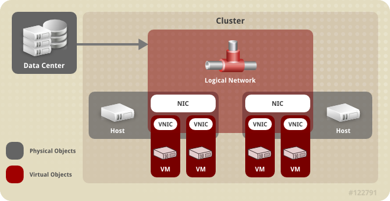

# 逻辑网络简介

逻辑网络是指您数据中心中一组全局网络连接属性的命名集合。将一个逻辑网络添加到一台主机上之后，该逻辑网络可以使用主机特定的网络参数进行进一步的配置。逻辑网络利用使用率、类型以及需求对网络流量进行分类，从而来优化网络流。

逻辑网络支持同时进行网络连接和网络隔离。您可以创建一个用于存储通信的逻辑网络来优化主机与存储域之间的网络流量，创建一个特殊的只用于所有虚拟机流量的逻辑网络，或者创建多个逻辑网络共同承担几组虚拟机的流量。

在所有的数据中心中，默认的逻辑网络是名叫 **eayunosmgmt** 的管理网络,在您创建其他的逻辑网络之前，该逻辑网络将承载所有的网络流量。该逻辑网络被设计用于 EayunOS 企业级虚拟化管理端和主机之间的通信。

逻辑网络是数据中心层面上的资源；这意味着当您在数据中心中创建一个逻辑网络时，该逻辑网络对该数据中心中的所有集群都是可用的。一个被指定为**必需**逻辑网络必须要在它可操作之前在集群的所有的主机上配置好才行。**可选网络**能够被任何添加了该逻辑网络的主机使用。

**数据中心对象**

> **警告**

> 不要在主机运行时修改所属数据中心或者集群中的网络配置，因为这会造成连接不到主机的风险。

 
> **重要**
>
> 如果您计划使用 EayunOS 节点来提供任何服务，请记住如果 EayunOS 虚拟化环境停止运行， 那么服务也会相应停止。
>
> 这使用于所有服务，但是您必须尤其注意在 EayunOS 中运行以下服务的风险:
>
> -   目录服务
>
> -   DNS
>
> -   存储服务
>
