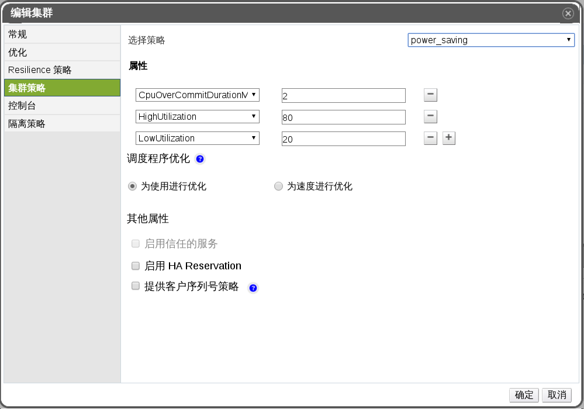

# 在一个集群中设置主机的负载与电源管理策略

**概述** 

集群策略允许您指定可接受的 CPU 使用值（最高值和最低值），还可以设置 CPU 使用值超出可接受范围时会发生的事件。定义集群策略将会启动集群中主机间自动进行均衡负载的功能。

如果主机的 CPU 使用值超过了 **HighUtilization** 的值，系统会将该台主机上的虚拟机到其它主机上，从而降低 CPU 负载。

如果主机的 CPU 使用值低于 **LowUtilization** 的值，系统会将该台主机上运行的所有的虚拟机迁移到其它的主机上，从而可以关闭这台主机。如果哦系统再次需要这台主机的时候，它会被再次启动。

**为主机设置负载和电源管理策略**

1. 使用资源标签页，树形模式或搜索功能来查找并选择结果列表中的集群。

2. 点击**编辑**按钮，弹出**编辑集群**窗口。
 

 **编辑集群策略**

3. 点击**集群策略**标签，选择以下策略中的一个：
 * **none**

 * **evenly_distributed** - 在 **HighUtilization** 旁边的文本框中输入虚拟机需要进行迁移的 CPU 使用率的百分比值。在 **CpuOverCommitDurationMinutes** 旁边的文本框中输入一个时间间隔的值，当 CPU 的使用率超出了设定值时，系统会等待您设置的时间后才会触发相关策略中的操作。

 * **power saving** - 在 **HighUtilization** 旁边的文本框中输入主机被认为是处于低利用率状态的 CPU 使用率的百分比值。在 **HighUtilization** 旁边的文本框输入主机需要进行迁移的 CPU 使用率的百分比值。

 * **vm_evenly_distributed** - 在 **HighVmCount** 旁边的文本框中输入虚拟机数量的最大值。在 **MigrationThreshold** 旁边的文本框中输入一个用于迁移缓冲区的大小。在 **SpmVmGrace** 旁边的文本框中输入为 SPM 主机预留的虚拟机数量。

4. 如果您正在使用一个 OpenAttestation 服务器来验证您的主机，并使用 **engine-config** 工具对服务器进行了设置，那么请您选择 **启用信任的服务** 复选框。

5. 点击**确定**。

**结果** 
您已经成功的对集群进行了编辑。
