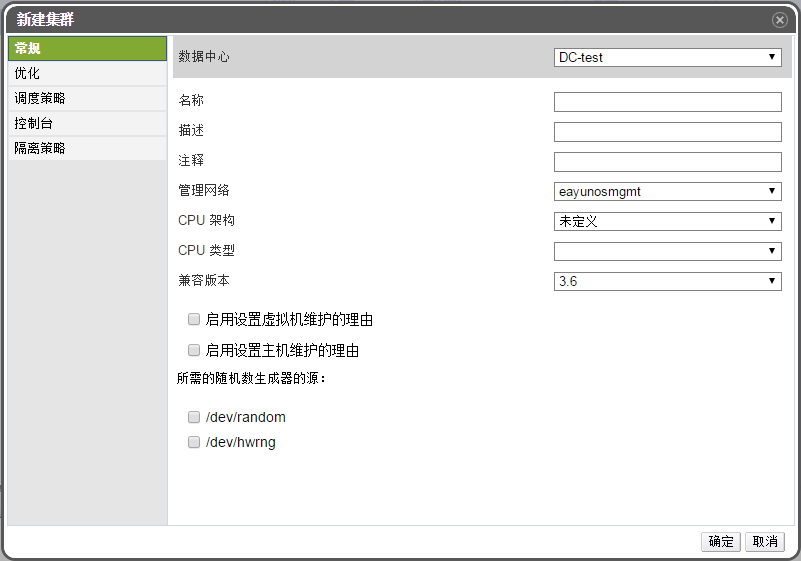

# 集群常规配置的解释

**新建集群**

下面的表格描述了**新建集群**或**编辑集群**窗口中**常规**标签下的设置：

**常规集群设置**

| 项 | 描述/操作 |
| -- | --------- |
| **数据中心** | 集群所在的数据中心。 |
| **名称** | 集群的名称。这个文本框最多可包含 40 个字符且要保证是独一无二的名称，可以是任意的大小写字母，数字，短横线和下划线的组合。 |
| **描述** | 集群的描述。我们建议您填写，但这并不是强制性的。 |
| **CPU 名称** | 集群的 CPU 类型，可从下列中选出（顺序：由高到低）：  -   Intel Conroe Family  -   Intel Penryn Family  -   Intel Nehalem Family  -   Intel Westmere Family  -   Intel SandyBridge Family  -   Intel Haswell  -   AMD Opteron G1  -   AMD Opteron G2  -   AMD Opteron G3  -   AMD Opteron G4  -   AMD Opteron G5  一个集群内的所有主机必须使用相同类型的 CPU (Intel 或 AMD); 一旦集群被成功创建后，其 CPU 类型将不允许变动。关于 CPU 的类型，请您尽可能选择低级别的主机的 CPU 类型。例如，一个 **Intel SandyBridge** 的主机可以附加到一个 **Intel Penryn** 的集群中的，相反，**Intel Conroe** 的主机则不可以附加到 **Inter Penryn** 中。如果集群中的主机的 CPU 类型不同，那么只有所有类型都具有的 CPU 指令集才可以被使用。 |
| **兼容版本** | EayunOS 企业级虚拟化的版本号，你可以从以下选择：  -   3.0  -   3.1  -   3.2  -   3.3  -   3.5  您不能选择比数据中心的版本更低的版本。 |
| **启用Virt服务** | 如果您选择了此单选框，在该集群下的主机会被用于运行虚拟机。 |
| **启用Gluster服务** | 如果您选择了此单选框，那么运行在该集群下的主机会作为 EayunOS 存储服务器节点，而不是用来运行虚拟机。且用户不能将 EayunOS 企业级虚拟化宿主机添加到该集群中。 |
| **启用设置虚拟机维护的理由** | 如果您选择了这个单选框，那么如果您想要对虚拟机进行 **关机** 或者 **断电** 操作的话，您必须写明您要这个做的原因，以便其它管理员可以理解您的行为。 |
| **所选随机数生成器的源** | 集群中的宿主机可以将随机数生成器提供给虚拟机使用。**/dev/random** 可以生成高随机性的公钥或一次性密码本。如果熵池（Linux 内核维护了一个熵池用来收集来自设备驱动程序和其它来源的环境噪音）空了，对 **/dev/random** 的读操作将会被阻塞，直到收集到了足够的环境噪声为止，它是真正的随机数发生器。对于 KVM 虚拟机来说，存在一个半虚拟化设备 virtio-rng 作为硬件随机数产生器。virtio-rng 设备会读取 Host 的随机数源并且填充到虚拟机的熵池中。通常情况下使用 **/dev/random** 作为输入源。当 Host 系统中存在 hwrng 的情况下你可以用 **/dev/hwrng** 来作为 virtio-rng（对于 KVM 虚拟机来说，存在一个半虚拟化设备 virtio-rng 作为硬件随机数产生器）的输入源。  |

**修改集群 CPU 级别**
