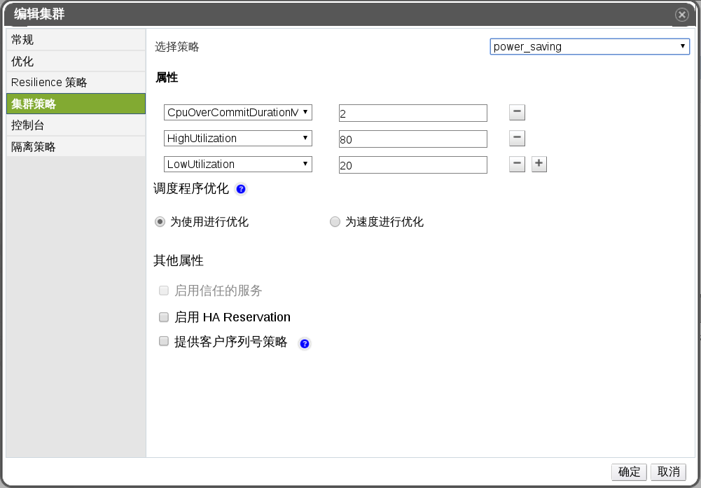
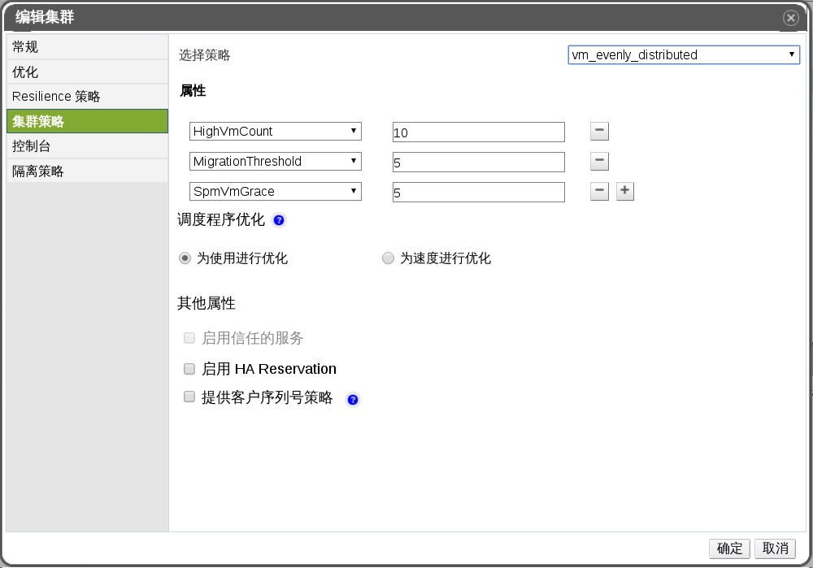

 # 集群策略的解释

集群策略允许你指定使用并在可用主机间进行虚拟机的分配。定义集群策略可以在同一集群的主机中进行自动负载均衡。

**图3.3. 集群策略设置：节能策略和均匀分配策略**

**图3.4. 集群策略设置：虚拟机平均分配策略*

下面的表格描述了**编辑集群**窗口的设置。

表4.4. 集群策略标签下的属性

|填充项/标签|描述/操作|
|------|---------|
|none|将策略设置为 **None**，即表示不在主机间采用任何负载或电源策略。此为默认选项。|
|evenly_distributed|在集群的所有主机中平均分配 CPU 处理负载。如果一台主机打到了其预先定义的服务级别，那么负载在其上的虚拟机将无法开启。|
|power_saving|分配CPU的处理负载在可用主机，以减少对没有得到充分利 用主机的功耗。当主机的CPU负载低到预设的下限值时，且 超出预定义的时间间隔，则将这台主机中的所有虚拟机迁移 到其它主机中，此主机可以关闭电源。。当主机的 负载达到预先定义的上限值时，就无法在此主机启动虚拟机。|
|vm_evenly_distributed|
|CpuOverCommitDurationMinutes|在集群策略生效之前，主机中运行的负载超过或低于预设值的 时间间隔(以分钟为单位）。最大99分钟。在规定的时间间隔内 可以防止由于临时高峰负载而启动集群策略，从而导致作出不 必要的迁移。|
|HighUtilization|CPU的利用百分比。如果主机的CPU负载运行在预设值或之上，且超出 预订时间间隔，OVIRT管理程序会迁移虚拟机到集群中其他 主机中，直到CPU的负载低于这个预设值。|
|LowUtilization|CPU的利用百分比。如果主机的CPU负载低于这个预设值，且超出预订 时间间隔，OVIRT管理程序会将虚拟机迁移到集群中其他主机， 管理程序不会关闭此主机，管理员必须手动去关闭。|
|调度程序优化|
|启用信任的服务|是否激活与OpenAttestation服务的集成。在激活之前，请使用*engine-config*工具配置OpenAttestation服务的细节。|
|启用HA Reservation|
|提供客户序列号策略|
> **Note**
>
> 当主机释放内存超过20%时，ballooning的命令在日志文件**/var/log/vdsm/mom.log*
> 会有类似的*mom.Controllers.Balloon - INFO Ballooning guest:half1 from
> 10964 00 to 1991580**的记录。*/var/log/vdsm/mom.log*是内存超额使用管理程序的日志文件。
