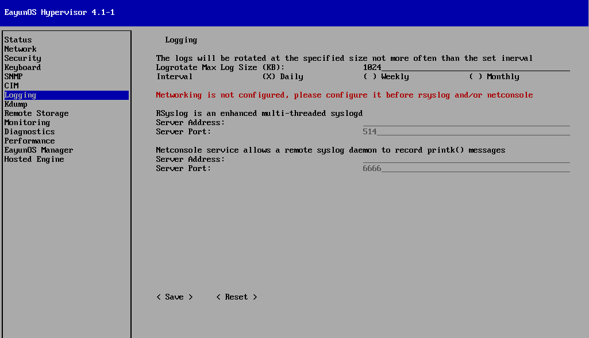

# 配置 Hypervisor 日志记录

**摘要**

* 选择左侧的 Logging，切换到 Logging 界面。
* Hypervisor 创建并维护来大量的日志文件。Logging 界面允许配置一个守护进程来自动导入这些日志到远程服务器中。

1. logrotate 配置

   程序 logrotate 可以简化日志文件的管理。当日志文件达到指定文件大小的时候，Hypervisor 使用 logrotate 来对日志进行轮转操作。

   日志的轮转包括当前日志文件的重命名和创建一个新的日志文件。Logging 界面中的 Logratate Max Log Size 的数值就是用来决定当 log 多大的时候需要轮转的。

   以KB为单位，输入一个数值来设定 Logrotate Max Log Size。默认大小是1024KB。

2. rsyslog 配置

   rsyslog 是一个多线程的 syslog 守护进程。Hypervisor 可以使用 rsyslog 在网络上传输 log 文件到远程的 syslog 守护进程。

   1. 在 Server Address 一栏输入远端的 rsyslog 服务器的地址。
   1. 在 Server Port 一栏输入远端 rsyslog 服务器的端口。默认端口是 514。

3. netconsole 配置

   netconsole 模块允许内核消息发送到一个远程的机器。Hypervisor 使用 netconsole 在网络上传递内核消息。

   1. 输入服务器的地址。
   1. 输入服务器的端口。默认端口是 6666。

4. 保存配置

   选择&lt; Save &gt;并按下【Enter】键，保存日志配置。

**结果**

日志配置成功。
