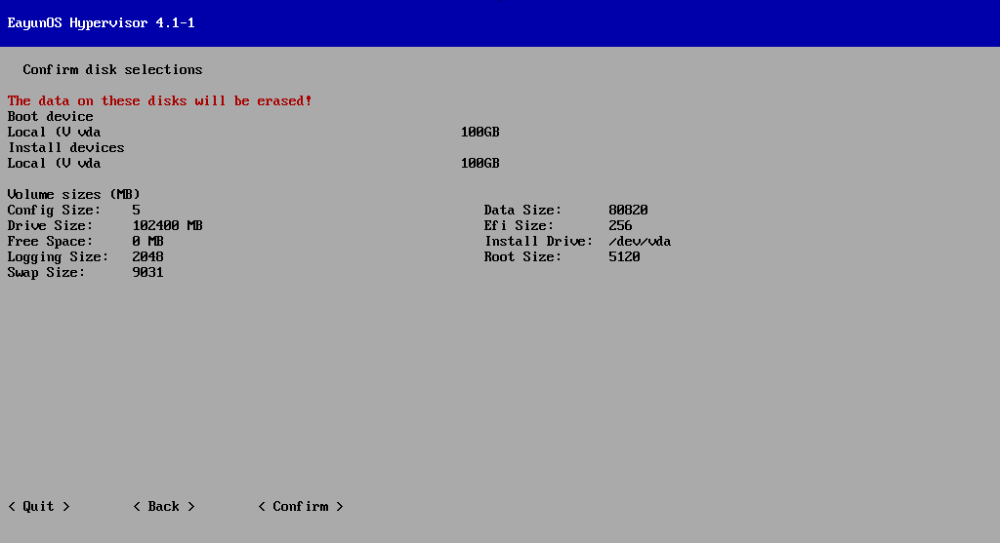
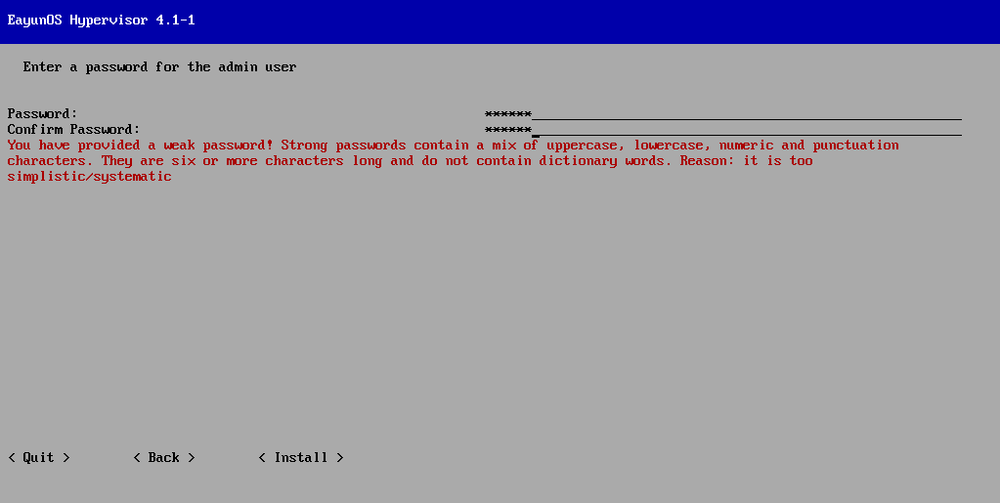
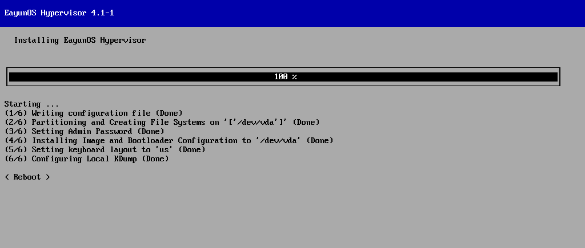

# 安装 EayunOS 虚拟化管理中心宿主机

1. 菜单操作说明

   1. 方向键（Up，Down，Left，Right）可以选择屏幕上的不同控件。通过【Tab】键来在不同的控件中循环移动。
   2. 一段下划线（_）代表文本栏。可以选择文本栏，在其中输入数据。
   3. 使用一对尖括号（<and>）括起来的标签代表按钮。选择按钮后，可以按下【Enter】键或空格键来激活它。
   4. 使用一对方括号（[and]）括起来的星号（*）或者空格符代表了一个布尔选项。当方括号中间有一个星号的时候代表该项被选，否则就没有被选中。选择或者取消一个布尔选项只需要选中该控件并按空格键就可以了。

2. 安装 EayunOS （交互式安装）

   1. 使用准备好的启动盘启动将要安装 EayunOS 的机器。
   2. 选择【Start  EayunOS 】，按下【Enter】键，进入安装界面。
   3. 在Installation窗口中，选择< Install Hypervisor 4.1-apha-2 >（要更新内容），按下【Enter】，开始安装流程；或者选择< Quit >放弃安装。
   4. 首先需要对键盘进行相应的配置，需要选择合适的键盘布局。使用【Up】和【Down】键来选择合适的选项，并按【Enter】键保存你的选择。（图（或例）键盘布局配置）
   5. 安装脚本自动识别出系统中的所有的硬盘。帮助选择启动和安装Hypervisor的硬盘。该界面的每一项包含每个硬盘的Location，Device Name 和Size。（图 启动设备选择）

     第一个硬盘选择界面用来选择Hypervisor启动盘。在该界面选择硬盘后，会把Hypervisor的引导程序安装到该硬盘的主引导记录（MBR）。Hypervisor尝试自动检测系统中的硬盘，然后列出可以用来做启动硬盘的设备。你可以通过Other Device选项手动选择一个块设备。

     > **重要**
     >
     > 所选择的硬盘必须被是一个可引导设备，而且要么在系统BIOS的启动顺序中出现，要么在预存在的引导程序中。

     * 选择自动到检测的设备

       从列表中选择 EayunOS 的启动硬盘，并按下【Enter】键。

       选择硬盘并按下【Enter】键。这一步保存启动设备的选择并继续下一步的安装。

     * 手动选择设备

       选择< Other Device: >并按下【Enter】键。

       当提示`Please enter one or more disks to use for installing  EayunOS  Hypervisor`，输入Hypervisor应该启动的块设备的名称。

       > ##### 示例
       >
       > ```
       > Custom Block Device
       >
       > Please enter one or more disks to use for installing  EayunOS  Hypervisor. Multiple devices can be separated by comma.
       >
       > Device path:
       > /dev/sda__________________
       > ```

        （图 使用其他设备）

       选择 < Save > 并按下【Enter】键，该操作将保存启动设备并继续下一步安装。

       选定用来安装的硬盘将安装 EayunOS 。Hypervisor自动检测系统中的硬盘并从选择的设备上进行安装。

       选择 < Continue > 按钮并按下【Enter】键

   6. 接下来，应该配置 EayunOS 系统的存储

      选择或取消`Fill disk with Data partition`。该项是默认选择，如果不选择该项，将会看到磁盘剩余的空间，并允许指定给数据分区分配的大小。

      设置Swap，Config，Logging的大小，以MB为单位。

      如果选择了`Fill disk with Data partition`，Data这一项无法编辑。如果没有选择，你可以为保留空间设置一个数值。输入-1意味着占用所有的剩余空间。

      （图 配置存储）

      选择 < Continue > 并按下【Enter】键，保存设置并继续下一步操作。

   7. 对存储的设置有一个预览，选择 < Confirm > 并按下【Enter】，确认存储设置并继续下一步操作。

      

      > **警告**
      >
      > 选定的存储设备上的所有的数据都会被破坏。

   8. EayunOS 系统需要设置一个密码，以此来保护admin用户的控制台访问。安装时需要在Password和Confirm Password中输入锁设置的密码，两次密码的填写要一致。

      

      最好使用一个强壮的密码。一个强壮的密码可以是大小写字母、数字和标点字符的混合。密码最少6个字符，不能包含目录字符。

      选择< Install >并按下【Enter】键，开始安装Hypervisor到指定的硬盘上。

      

**结果**

当安装结束时，将会提示重启。选择< Reboot >按钮并按下【Enter】键，重启系统。



> **注意**
>
> 移除启动设备，并修改系统启动项，避免重启后又进入安装流程。

<br/>
> **注意**
>
>  EayunOS  Hypervisor 可以在 SANS 和其他网络存储中保存客户虚拟镜像。Hypervisor 也可以被安装在 SANs 中， 作为 BIOS 中的一个启动设备，提供 HBA 配置许可。

<br/>
> **注意**
>
> Hypervisor 的安装可以使用多路径设备。SANS 和其他网络存储经常使用多路径。安装的时候默认是开启多路径的。可以响应 scsi_id 函数的块设备都是多路径的。这些设备不包括 USB 存储设一些老的 ATA 硬盘。
