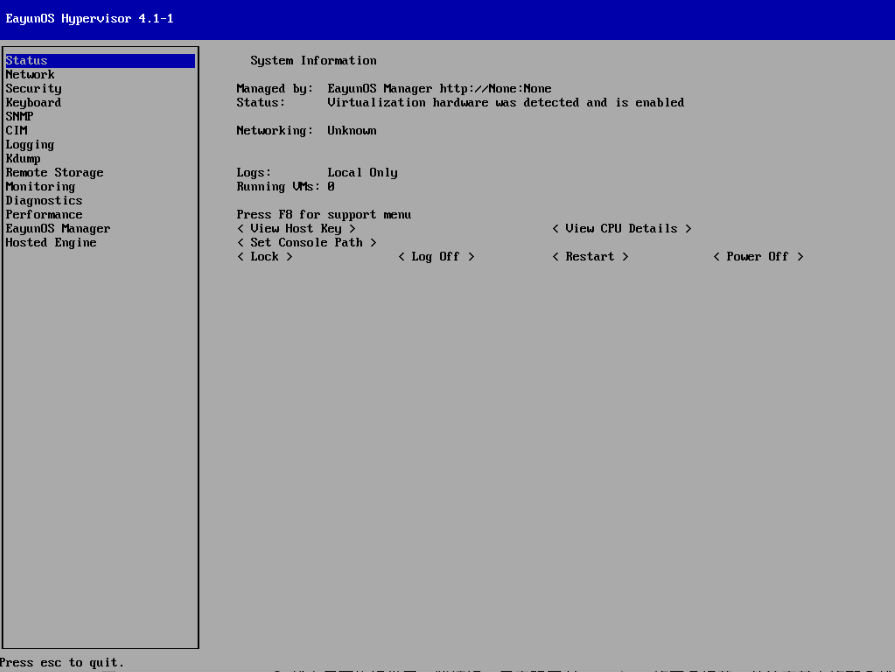

# 观察 Hypervisor 的状态

1. 选择左侧的 Status 项，可以看到系统当前的状态的简要描述。

   显示信息包括：

      * Hypervisor 的当前状态（Status）
      * 网络当前状态（Networking）
      * 按下【F8】键，显示当前日志和报告文件的目的位置
      * 活跃的虚拟机个数（Running VMs）

   

2. 状态界面也提供了一些按钮，用来观察 Hypervisor 的更多细节，并该变其中的部分状态。

   按钮的解释：

      * < View Host Key > : 显示了 Hypervisor 的 RSA 主机秘钥指纹，和主机秘钥。
      * < Details > : 显示了 Hyperviosr 使用的CPU的细节，例如CPU的名称和类型。
      * < Lock > : 进观察 Hyperviosr 的状态入锁屏界面。必须输入正确的用户名和密码才可以解锁并进行其他操作。
      * < Log Off > : 退出当前用户。
      * < Restart > : 重启 Hypervisor。
      * < Power Off > : 关闭 Hypervisor 的电源。

