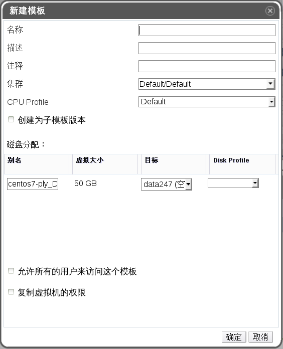

# 创建一个模版

**概述** 
根据一个已经存在的虚拟机创建一个模板，并使用所创建的模板作为创建其它虚拟机的“蓝图”。

**根据已经存在的虚拟机创建一个模板**

1. 选**虚拟机**标签页并选择一个虚拟机。

2. 确认虚拟机已被关机，并处于 **Down** 状态。

3. 点**创建模板**打开**新建模板**窗口。
    
   **新建模板窗口**

4. 为要创建的新模板输入**名称**、**描述**和**注释**。

5. 从**集群**下拉菜单中选择新建模板所在的集群。在默认情况下，它会在原始虚拟机所在的同一个集群中。

6. 另外，您可以选择**创建为子模板版本**选项。选择一个**根模板**并输入一个**子版本名称**来把新创建的模板作为一个已存在模板的子模板。

7. 在**存储分配**区中的**别名**项中为磁盘输入一个别名，并在目标下拉菜单中选择这个磁盘所在的存储域。在默认情况下，这些设置与原始的虚拟机相同。

8. 在默认的情况下，**允许所有的用户来访问这个模板**选项被选择。这将使新创建的模板成为一个公共模板。

9. 在默认的情况下，**复制虚拟机的权限**选项不会被选择。如果选择了它，原始虚拟机的权限设置会被复制到新的模板中。

10. 点**确定**。

**结果** 
在模板被创建的过程中，它的状态为 **Image Locked**。根据虚拟机磁盘的大小以及您的存储硬件，创建模板可能会需要长达一个小时的时间。在创建完成后，新建的模板被添加到**模板**页中。您现在可以通过新建的模板来创建新虚拟机了。

> **注意**
>
> 在创建模板时，整个原始虚拟机会被复制。因此在创建完成后，原始虚拟机和它的模板都可以被使用。
