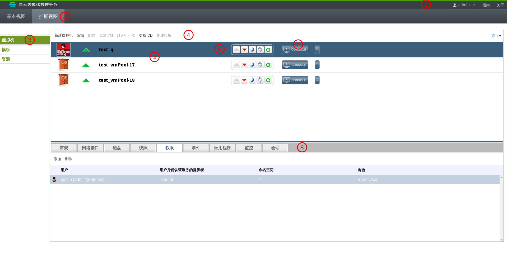

# 扩展视图界面

您可以通过**扩展视图**标签页来访问并监测对您有效的所有虚拟资源。以下介绍了**扩展视图**标签页中的 8 个元素。

**扩展视图标签页**

**扩展视图标签页**

| **序号** | **元素名称** | **描述** |
| -------- | ------------ | -------- |
| 1 | 标题栏 | 包括登录到用户门户的**用户**的名称，以及到**指南**页和**关于**页的链接。 |
| 2 | 用户门户的视图选项标签 | 高级用户（power user）可以使用用户门户中的**扩展视图**标签页和**基本视图**标签页。基本视图是一般用户看到的默认视图。 |
| 3 | 导航面板  | 您可以使用导航面板来在虚拟机标签页、模板标签页和资源标签页间进行切换。 |
| 4 | 管理栏 | 管理栏被用来创建并修改虚拟机。 |
| 5 | 虚拟机列表 | 虚拟机列表，包括它们的操作系统，以及它们的状态（运行状态、暂停状态或停止状态）。 |
| 6 | 虚拟机控制按钮 | 虚拟机控制按钮可以被用来启动、停止、暂停或关闭虚拟机。<ul><li> 绿色的运行按钮用于启动虚拟机，您可以在虚拟机处于暂停、关闭或断电的状态时使用它。</li><li> 红色的停止按钮用于停止虚拟机的运行，您可以在虚拟机处于运行的状态时使用它。</li><li> 蓝色的暂停按钮会暂停虚拟机的运行。想要重新运行它，请点绿色的运行按钮。</li><li> 关机按钮会关闭虚拟机。您可以在虚拟机处于运行状态时使用它。</li><li> 重新启动按钮会重启虚拟机。您可以在虚拟机处于运行的状态时使用它。</li></ul> |
| 7 | 控制台按钮 | 点控制台按钮会启动一个 SPICE 窗口，并连接到已经运行的虚拟机上。 |
| 8 | 详情面板 | 详情框显示了所选虚拟机的详细信息。 |

**详情框中的标签页：**
* **常规**标签页显示了虚拟机的基本软硬件信息，包括它的名称、操作系统、显示协议和定义的内存。

* **网络接口**标签页显示了与虚拟机相连的网络的名称、类型、速度等信息。您可以在这个标签页中添加、编辑和删除网络接口。

* **磁盘**标签页显示了附加到虚拟机上的磁盘的名称、大小、格式等信息。您可以在这个标签页中添加、编辑和删除虚拟磁盘。

* **快照**标签页显示了虚拟机的操作系统，以及所安装的应用程序的信息。您可以在这个标题页中创建和使用快照。

* **权限**标签页显示了分配给每个虚拟机的用户和角色。您可以使用该标签来分配和删除用户的权限。

* **事件**标签页显示了可能对虚拟机有影响的事件的描述，以及事件所发生的时间。

* **应用程序**标签页显示了在虚拟机上安装的应用程序。

* **监控**标签页显示了已选虚拟机的 CPU 使用情况、内存使用情况以及网络使用情况的统计数据。

* **会话**标签页显示了所选虚拟机上的登录用户、控制台用户和控制台客户端的 IP。
